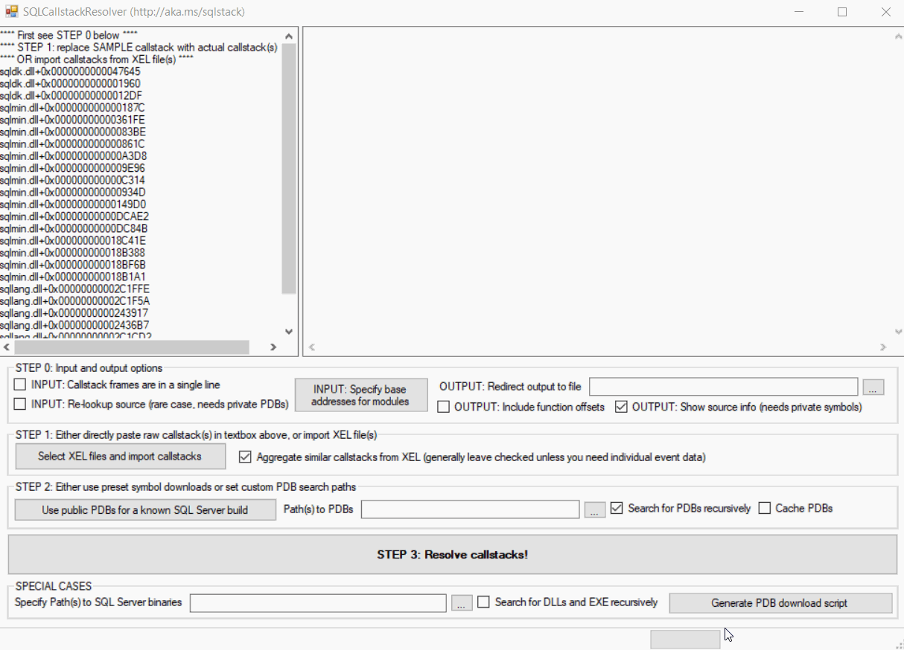
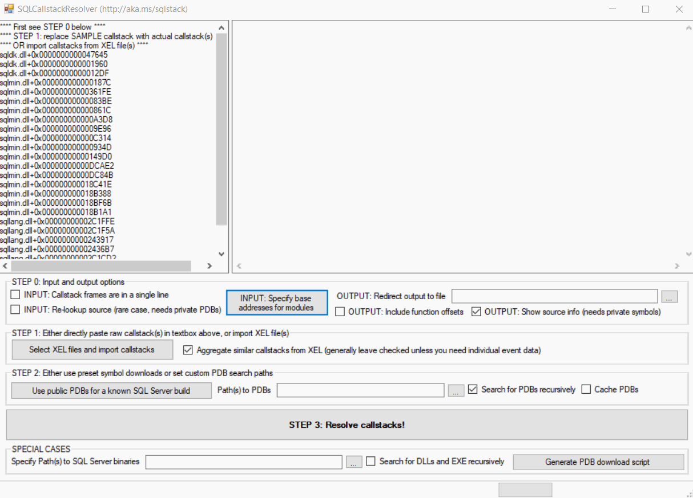

[](https://github.com/arvindshmicrosoft/SQLCallStackResolver/actions)
# Installation
Please refer to the Releases section for a ready-to-run set of binaries. Release 2.0 is self-contained, XCOPY / UnZip and run - no external installation required other than .NET Framework 4.7.2 or above. We now include the [msdia140.dll](https://blogs.msdn.microsoft.com/calvin_hsia/2016/07/30/whats-in-a-pdb-file-use-the-debug-interface-access-sdk/) and [XELite](https://www.nuget.org/packages/Microsoft.SqlServer.XEvent.XELite/) as part of the ZIP file with the rest of the binaries. Note that SQLCallStackResolver 2.0 is released as purely for 64-bit Intel/AMD family (x64) Windows OS. Release 2.0 also uses registration-free COM activation of msdia140.dll, which is included in the ZIP. There is no longer a need to explicitly register this DLL.

Note: DIA, and associated necessary Visual C++ runtime dependency DLLs (msvcp140.dll, vcruntime140.dll and vcruntime140_1.dll are redistributable components of Visual Studio 2019 subject to terms as published [here](https://docs.microsoft.com/en-us/visualstudio/releases/2019/redistribution). Windows Debugging Tools DLLs (dbghelp.dll and symsrv.dll) are used as per the terms published [here](https://docs.microsoft.com/en-us/legal/windows-sdk/redist#debugging-tools-for-windows).

# Usage
The tool comes with a pre-populated example in the textboxes, just follow that example with your real-world stack(s). The textbox on the left accepts the following types of input:

* Individual callstack extracted from XML, with DLL + offset notation
* Multiple callstacks in Histogram XML markup (multiple-instance case of above)
* Older format with just virtual addresses [[1]](#footnote1)
* dll!Ordinal### format [[2]](#footnote2)
* Output from SQLDumper (SQLDumpNNNN.TXT file) - at least the sections which have stack frames [[5]](#footnote5)

In all cases you must provided a symbol search path [[3]](#footnote3),[[4]](#footnote4). If a symbol server is used in this path, there must be corresponding information in the input callstack to help identify which PDBs to get from the symbol server. See [[6]](#footnote6).

## Usage example #1
This is a trivial case, where the user enters the callstack in DLL + offset notation, and selects one of the pre-populated list of SQL builds to download symbols. The user then clicks the Resolve Callstacks button, and obtains the symbolized output in the right-hand side textbox.



## Usage example #2
This is a typical use case, where the user imports events from a XEL file. Because the XEL file does not have the module base addresses, the user first inputs those. They then select one of the pre-populated list of SQL builds to download symbols and finally click the Resolve Callstacks button to obtain the symbolized output in the right-hand side textbox.



# Community
[](https://gitter.im/SQLCallStackResolver/community?utm_source=badge&utm_medium=badge&utm_campaign=pr-badge&utm_content=badge)

# Contributing
We welcome contributions - if you are interested to help, please fork the project, and submit your contributions via pull requests. Do note:

* You will need Visual Studio 2019+ installed to build this solution.
* Once you load the SLN, you might need to fix the reference to msdia140typelib_clr0200.dll (found under `<<VisualStudioFolder>>\Team Tools\Performance Tools\Plugins\` or `<<VisualStudioFolder>>\Common7\IDE\Extensions\TestPlatform)`. You can also get this file by installing [Performance Tools for Visual Studio 2019](https://visualstudio.microsoft.com/downloads/#performance-tools-for-visual-studio-2019)
* Access to NuGet is needed to fetch and restore package dependencies.
* Tests are implemented using [xUnit](https://xunit.net/docs/getting-started/netfx/visual-studio#run-tests-visualstudio). Make sure you follow instructions and ensure that the tests are passing before submitting a PR.
* When a PR is submitted, there is a GitHub Actions workflow which will build the project and run tests. PRs cannot merge till the workflow succeeds.

# Notes
1. <a name="footnote1"></a>In this case you need to populate the Base Addresses with the output of the following query from the actual SQL instance when the XE was captured:
``` sql
select name, base_address from sys.dm_os_loaded_modules where name not like '%.rll'
```
2. <a name="footnote2"></a>In this case, you need to press the Module Paths button where you will be prompted to enter the path to a folder containing the images of the DLLs involved. For example you can point to C:\Program Files\Microsoft SQL Server\MSSQL13.MSSQLSERVER\MSSQL\Binn for SQL 2016 RTM CU1

3. <a name="footnote3"></a>This has to be path to a folder or a set of such paths (can be UNC as well) each separated with a semicolon (;). Use the checkbox to specify if sub-folders need to be checked in each case. If multiple paths might contain matching PDBs, the first path from the left which contained the PDB wins. There is no means to know if the PDB is matched with the build that your are using - you need to ensure that the folder path(s) are correct!

4. <a name="footnote4"></a>To obtain public PDBs for major SQL releases, PowerShell scripts are available in the SQLCallStackResolver [Wiki](https://github.com/arvindshmicrosoft/SQLCallStackResolver/wiki/Obtaining-symbol-files-(.PDB)-for-SQL-Server-Releases)

5. <a name="footnote5"></a>This is partial support at the moment - subsequently I will add a 'cleansing' option where it will strip out just the 'Short Stack Dump' sections and resolve the frames therein.

6. <a name="footnote6"></a>It is possible to use a symbol server in the symbol search path. For example, the symbol search path can be specified as `srv*c:\syms*https://msdl.microsoft.com/download/symbols`. In such a case, the corresponding callstack input should have a minimal set of details included in separate lines, each containing comma-separated values. Each of these lines should include the following minimum set of information:
* DLL file name, for example `ntdll.dll`
* PDB file name, for example `ntdll.pdb`
* PDB GUID, for example `1EB9FACB-04C7-3C5D-EA71-60764CD333D0`
* The very last comma-separated field will be taken as the PDB Age.

All other fields in the line are ignored. Here is an example of a complete line with the minimum information necessary:
`ntdll.dll,ntdll.pdb,1EB9FACB-04C7-3C5D-EA71-60764CD333D0,1`

When such information is included (usually after the main callstack input), it is parsed and used to retrieve PDBs from the symbol server specified. If matching PDBs are not found locally for whatever reason (wrong paths, wrong metadata, failed download etc.), the symbol resolution step will just return back the original raw input.
